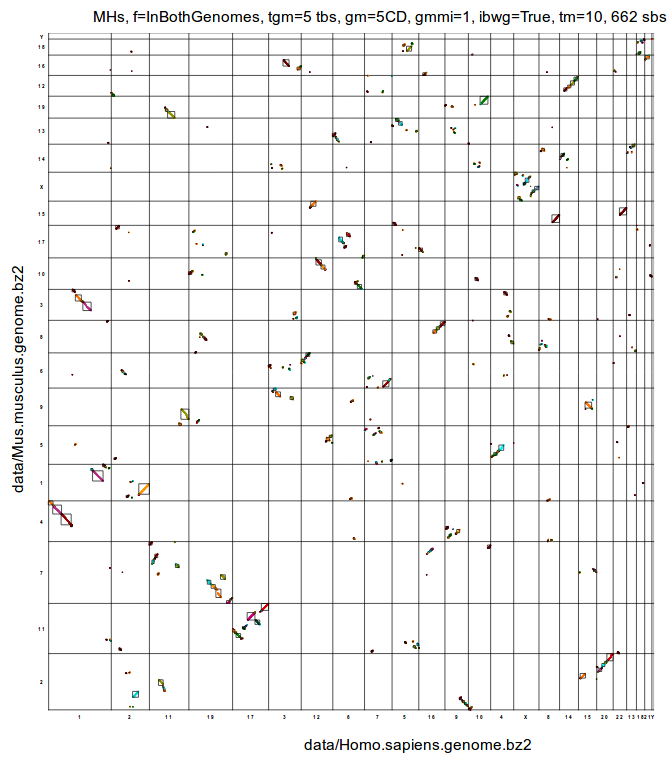
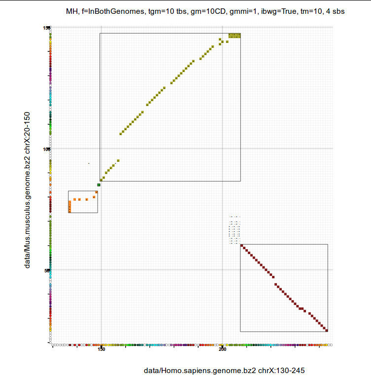

# PhylDiag
[](https://zenodo.org/badge/latestdoi/19742670)

From the comparison of two extant genomes and corresponding gene families, PhylDiag detects conserved segments, i.e. segments of chromosomes unbroken during evolution.

**Inputs**
* two extant *genomes*, G1 and G2
* *a set of gene families*, F

**Outputs**
* *conserved segments*

Example of
* genome:  data/Homo.sapiens.genome.bz2
* set of families: data/Euarchontoglires.families.bz2
* conserved segments: res/Homo.sapiens_Mus.musculus_fEuarchontoglires.sbs

Gene families can be computed from a forest of phylogenetic gene trees, see https://github.com/DyogenIBENS/LibsDyogen.

A genome is a set of chromosomes.
A chromosome is a list of genes.
A gene is a pair (gene name, transcription orientation).

F, the set of gene families, is an associative array that links, for each family,
* the family name (**key**)
* to the set of names of the descendant genes (**values**)

The name of a gene family is often the name of the ancestral gene, at the root of the gene family.

PhylDiag can also return *syntny blocks*, if
* identification of micro-rearrangements,
* identification of mono-genic conserved segments
* identification of mono-genic inversions

are disabled.

PhylDiag is explained in more details in two publications
1. [PhylDiag : identifying complex synteny blocks that include tandem duplications using phylogenetic gene trees](https://bmcbioinformatics.biomedcentral.com/articles/10.1186/1471-2105-15-268)
2. High precision detection of conserved segments from synteny blocks (FIXME update as soon as published)

and in a thesis manuscript in french

3. [Étude de l’évolution de l’ordre des gènes de vertébrés par simulation](https://tel.archives-ouvertes.fr/tel-01398369/document)

##### Link between synteny blocks and conserved segments

*Conserved segments* can be considered as a specific type of *synteny blocks*, with a threshold between micro and macro-rearrangements equal to 0 ancestral genes.
For this reason you may see some *conserved segments* being named more generally *synteny blocks* in the code, or with the extension *.sbs.

## Installation
[Install the LibsDyogen library first.](https://github.com/DyogenIBENS/LibsDyogen)
From now on we assume that the path to the folder LibsDyogen is in the PYTHONPATH.

The easiest way to install PhylDiag is to launch the remote script INSTALL.sh hosted on github.
This script will clone the github deposit itself.
The installation will be set in /home/${USER}/Libs/PhylDiag.

Install curl, if you don't have it
```
sudo apt-get update
sudo apt-get install curl
```
Use curl to execute the remote file INSTALL.sh hosted on github
```
bash <(curl -s https://raw.githubusercontent.com/DyogenIBENS/PhylDiag/master/INSTALL.sh)
```

If it did not work, follow the next instructions.

### Dependencies
Core dependencies
* LibsDyogen

### Detailed installation guidelines
Choose a path for the parent folder of PhylDiag (here it is /home/<user>/Libs)
```PATH_PARENT_PHYLDIAG="/home/${USER}/Libs"
mkdir -p ${PATH_PARENT_PHYLDIAG}
cd ${PATH_PARENT_PHYLDIAG}
PATH_PHYLDIAG=${PATH_PARENT_PHYLDIAG}/PhylDiag
```
Clone the PhylDiag deposit
```
git clone https://github.com/DyogenIBENS/PhylDiag ${PATH_PHYLDIAG}
```
If necessary give execution rights
```
chmod +x ${PATH_PHYLDIAG}/src/*.py
chmod +x ${PATH_PHYLDIAG}/src/analysis/*.py
chmod +x ${PATH_PHYLDIAG}/src/postprocessing/*.py
```

It should be installed.
You can verify that everything works properly with some tests
```
cd PhylDiag
bash ./checkPhylDiagIntegrity.sh
```

## Usage
### PhylDiag
We assume that you are in the main folder of PhylDiag.

```
src/phylDiag.py --help
```
returns
```
usage: phylDiag.py [-h] [-m MINCHRLEN] [-f {None,InBothGenomes,InFamilies}]
                   [-t TANDEMGAPMAX] [-d {MD,ED,DPD,CD}] [-g GAPMAX]
                   [--imr | --no-imr] [--imcs | --no-imcs] [--mmg MMG]
                   [--truncation | --no-truncation]
                   [--truncationMax TRUNCATIONMAX] [-v]
                   G1 G2 F

positional arguments:
  G1                    genome1
  G2                    genome2
  F                     set of gene families

optional arguments:
  -h, --help            show this help message and exit
  -m MINCHRLEN, --minChrLen MINCHRLEN
                        minimum number of genes in considered chromosomes
                        (default: 2)
  -f {None,InBothGenomes,InFamilies}, --filter {None,InBothGenomes,InFamilies}
                        filter type (default: InBothGenomes)
  -t TANDEMGAPMAX, --tandemGapMax TANDEMGAPMAX
                        maximum gap between tandem duplicates in the same
                        cluster (default: 10)
  -d {MD,ED,DPD,CD}, --distanceMetric {MD,ED,DPD,CD}
                        metric used for the calculation of 2D distances. CD:
                        Chebyshev, MD: Manhattan, DPD: Diagonal Pseudo
                        Distance, ED: Euclidian (default: CD)
  -g GAPMAX, --gapMax GAPMAX
                        maximum 2D gap between chained homologies (default: 5)
  --imr                 identify micro-rearrangements (default: True)
  --no-imr
  --imcs                identify mono-genic conserved segments (default: True)
  --no-imcs
  --mmg MMG             maximum micro-gap, maximum gap allowed between: the
                        homology of a detectable micro-segment and the nearest
                        homology of a diagonal (default: 1)
  --truncation          truncate overlapping diagonals (default: True)
  --no-truncation
  --truncationMax TRUNCATIONMAX
                        maximum truncated length of the smallest overlapping
                        diagonals, above the diag. is fully removed, without
                        truncation (default: 10)
  -v, --verbose         verbosity (default: False)
```

3 files are required :
- genome1
- genome2
- families
in this order

Execute phylDiag with default values of options
```
src/phylDiag.py data/Homo.sapiens.genome.bz2 data/Mus.musculus.genome.bz2 data/Euarchontoglires.families.bz2 > res/consevedSegments.sbs
```
Here, each family is defined as a set of genes that derive from one gene in Euarchontoglires.
Euarchontoglires is the most recent common ancestor of extant human and mouse.

* The distance metric may be either the 'DPD', 'ED', 'MD' or 'CD' (in brackets). The default distance metric is 'CD' (in parenthesis).
* By default the filtering of extant genomes is 'InBothGenomes', meaning that only homologs present in both genomes are kept.

A standard way to launch PhylDiag is
```
src/phylDiag.py data/Homo.sapiens.genome.bz2 data/Mus.musculus.genome.bz2 data/Euarchontoglires.families.bz2 --tandemGapMax=5 --gapMax=5 --truncationMax=5 > res/consevedSegments.txt
```

Adding '--verbose' returns more information in logErr
```
src/phylDiag.py data/Homo.sapiens.genome.bz2 data/Mus.musculus.genome.bz2 data/Euarchontoglires.families.bz2 --tandemGapMax=5 --gapMax=5 --truncationMax=5 --verbose > res/consevedSegments.txt 2> res/logErr.txt
```

### PhylDiag Viewer

This viewer draw homology matrices with conserved segments.

```
src/phylDiagViewer.py --help
```
returns
```
usage: phylDiagViewer.py [-h] [-m MINCHRLEN]
                         [-f {None,InBothGenomes,InFamilies}]
                         [-t TANDEMGAPMAX] [-d {MD,ED,DPD,CD}] [-g GAPMAX]
                         [--imr | --no-imr] [--imcs | --no-imcs] [--mmg MMG]
                         [--truncation | --no-truncation]
                         [--truncationMax TRUNCATIONMAX] [-v]
                         [--ROI1 chr1:beg1-end1] [--ROI2 chr2:beg2-end2]
                         [--withSbs | --withoutSbs] [-s INSBS] [-i] [-b] [-r]
                         [-a SCALERECTS] [--considerAllComps] [-l] [-o OUTSBS]
                         G1 G2 F IMAGE

Graphical visualisation of synteny blocks in homology matrices

positional arguments:
  G1                    genome1
  G2                    genome2
  F                     set of gene families
  IMAGE                 path to the returned image.svg

optional arguments:
  -h, --help            show this help message and exit

  ... (same as with phylDiag)

  --ROI1 chr1:beg1-end1
                        region of interest (ROI) on the first genome (default:
                        None)
  --ROI2 chr2:beg2-end2
                        region of interest (ROI) on the second genome
                        (default: None)
  --withSbs             draw sbs in the homology matrix (default: True)
  --withoutSbs
  -s INSBS, --inSbs INSBS
                        synteny blocks to draw (*.sbs) (default: None)
  -i, --withSbIds       draw ids of synteny blocks (default: False)
  -b, --geneIdxsToTbIdxs
                        convert gene idxs to tandem block idxs (default:
                        False)
  -r, --chrsInTbs       draw chromosomes in tandem blocks (after collapsing
                        clusters of tandem duplicates) (default: False)
  -a SCALERECTS, --scaleRects SCALERECTS
                        scale factor of rectangle widths, if they are too
                        small increase it (default: 1.0)
  --onlyROIcomp         consider only comparisons of both ROIs (change the
                        filtering) (default: False)
  -l, --liveView        turn on direct view with firefox as soon as the
                        computation is finished (default: False)
  -o OUTSBS, --outSbs OUTSBS
                        information about drawn sbs (default: res/sbs.txt)

Warning: with --withoutSbs it may not return the desired homology matrix
```

#### Whole genome comparison

Draw the homology matrix of the comparison of the human and the mouse genomes
```
src/phylDiagViewer.py data/Homo.sapiens.genome.bz2 data/Mus.musculus.genome.bz2 data/Euarchontoglires.families.bz2 --tandemGapMax=5 --gapMax=5 res/WMH_Hs_Mm.svg --scaleRects=40
```
The output image can be seen with firefox.
<a>
  
</a>

#### Comparison of two regions of interest (ROI)

A region of interest is a segment of one chromosome, for instance the section between the 100th gene and the 200th gene of chromosome X in the first genome (--ROI1=X:100-200).
Another example: '4:45-80' means chromosome 4 from the 45th gene to the 80th gene.
```
a=Euarchontoglires
s1=Homo.sapiens
s2=Mus.musculus
c1=X
r1="130-245"
c2=X
r2="20-150"
dm="CD"
gm=10
suffix=Hs_${c1}.${r1}_Mm_${c2}.${r2}_${dm}${gm}
src/phylDiagViewer.py data/${s1}.genome.bz2 data/${s2}.genome.bz2 data/${a}.families.bz2 --distanceMetric=${dm} --gapMax=${gm} --ROI1=$c1:$r1 --ROI2=$c2:$r2 res/MH_${suffix}.svg --outSbs=res/${suffix}.sbs.txt --onlyROIcomp
```
<a>
  
</a>

A ROI may be a whole chromosome, e.g. 'X:1-~' is the ROI of chromosome X from the first gene to the last gene, ~.

Compute the Matrix of Homologies (MH) of the human X chromosome compared to the mouse X chromosome
```
src/phylDiagViewer.py data/Homo.sapiens.genome.bz2 data/Mus.musculus.genome.bz2 data/Euarchontoglires.families.bz2 --ROI1=X:1-~ --ROI2=X:1-~ res/MH.svg --outSbs=res/sbs.txt
```

It is also possible to draw the Matrix of Homology Packs (MHP), with the option --chrsInTbs. The MHP is the MH after filtering genomes and collapsing tandem duplicates.
```
src/phylDiagHomologyMatrixViewer.py data/Homo.sapiens.genome.bz2 data/Mus.musculus.genome.bz2 data/Euarchontoglires.families.bz2 --ROI1=X:1-~ --ROI2=X:1-~ --chrsInTbs ./res/MHP.svg --outSbs=./res/syntenyBlocksDrawerMHP.txt
```

## Update
If you want to keep PhylDiag up to date, update LibsDyogen first (see [the Update section of LibsDyogen](https://raw.githubusercontent.com/DyogenIBENS/LibsDyogen/master/README.md)).

Then
```
cd ${PATH_LIBSDYOGEN}
git pull
```
This will upgrade your local git deposit to the last commit.

If you want a more stable version, after `git pull`, you can downgrade to the latest tagged version (=stable release)
1. Get tags from the github deposit `git fetch --tags`
2. Get the latest tag name ``latestTag=$(git describe --tags `git rev-list --tags --max-count=1`)``
3. Checkout the latest tag `git checkout $latestTag`

After `git fetch --tags`, you can also switch to any anterior tagged version
1. List all tagged versions: `git tag -l`
2. Checkout to the version you want: `git checkout <tagName>`


**Please ensure that the versions of PylDiag and LibsDyogen share the same tagged version or correspond to their last commits.**

## Contributing
If you want to contribute to this deposit please
1. fork it
2. create your feature branch: `git checkout -b my-new-feature`
3. commit your changes: `git commit -am 'Add some feature'`
4. push to the branch: `git push origin my-new-feature`
5. submit a pull request

## Roadmap

1. Optimise the computation of the homology matrix with the "sort-join" algorithm of "step2" (page 3)

Khalid Mahmood, Geoffrey I. Webb, Jiangning Song, James C. Whisstock, Arun S. Konagurthu; [*Efficient large-scale protein sequence comparison and gene matching to identify orthologs and co-orthologs.*](https://www.ncbi.nlm.nih.gov/pmc/articles/PMC3315314/pdf/gkr1261.pdf) Nucleic Acids Res 2012; 40 (6): e44. doi: 10.1093/nar/gkr1261

2. Draw matrices of homologies with [Cairo](https://www.cairographics.org/)

## Credits
* Joseph Lucas: conceptualisation and implementation of phylDiag
* Hugues Roest Crollius: supervision
* Lucas Tittmann: improved the clustering of tandem duplicates
* Nga thi thuy Nguyen: optimisation of the core algorithm of PhylDiag with cython
* Matthieu Muffato: implementation several python functions in LibsDyogen

## License
This code may be freely distributed and modified under the terms of the GNU General Public License version 3 (GPL v3)
and the CeCILL licence version 2 of the CNRS. These licences are contained in the files:
* LICENSE-GPL.txt (http://www.gnu.org/licenses/gpl-3.0-standalone.html)
* LICENCE-CeCILL.txt (http://www.cecill.info/licences/Licence_CeCILL_V2-en.html)

Copyright for this code is held jointly by the Dyogen (DYnamic and Organisation of GENomes) team
of the Institut de Biologie de l'Ecole Normale Supérieure (IBENS) 46 rue d'Ulm Paris, and the individual authors.

## Contacts
* [Joseph Lucas](jlucas@ens.fr)
* [Hugues Roest Crollius](hrc@ens.fr)

## Cite as
Please cite our article "High precision detection of conserved segments from synteny blocks" accepted in Plos One, as soon as it is published.

FIXME

Otherwise cite our previous article

Joseph MEX Lucas, Matthieu Muffato, and Hugues Roest Crollius. Phyldiag: identifying
complex synteny blocks that include tandem duplications using phylogenetic gene trees.
BMC Bioinformatics, 15(1):268, 2014

